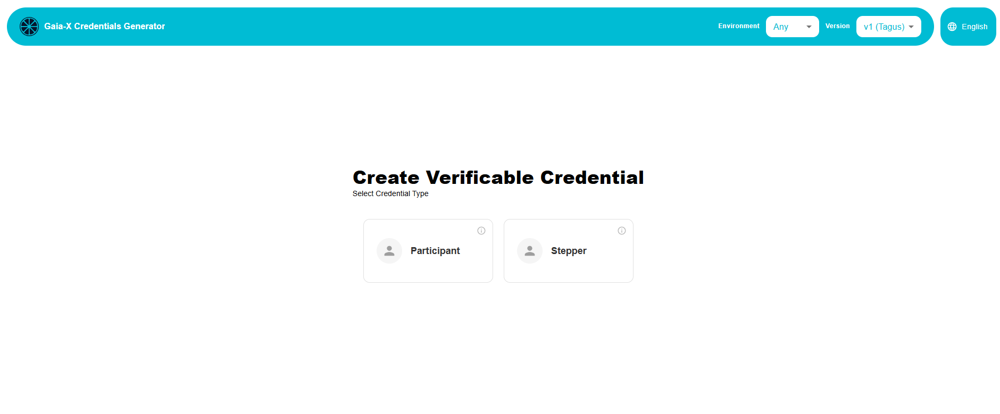

# Compliance Onboarding DataSpace

 


Project to incorporate the Gaia-X compliance widget to obtain participant credentials and service offerings.

<p align="center">
	<a href="https://apiaddicts.org/">
	  
	</a>
</p>

## Usage

Description of how to use this project if required. (For libraries)

## Run the project

Description of how to run this project. (For apps)

## Integración mediante iframe (PostMessage)

El widget se puede incrustar en un iframe. Al completar con éxito el flujo de cumplimiento normativo, envía los resultados al elemento padre mediante `postMessage`.

### Lo que devuelve el widget

```json
{
  «files»: [
    { «filename»: «legalParticipant.json», “content_in_base64”: «...» },
    { «filename»: «gx-terms-and-cs.json», “content_in_base64”: «...» },
    { «filename»: «legalRegistrationNumber.json», “content_in_base64”: «...» },
    { «filename»: «complianceCredential.json», “content_in_base64”: «...» }
  ]
}
```

| Archivo | Contenido |
|---------|-----------|
| `legalParticipant.json` | Certificado digital del participante legal firmado |
| `gx-terms-and-cs.json` | Certificado digital de términos y condiciones firmado |
| `legalRegistrationNumber.json` | Certificado digital del número de registro legal (firmado por el notario de Gaia-X) |
| `complianceCredential.json` | Credencial de cumplimiento emitida por Gaia-X (solo si la validación fue exitosa) |

Solo se envía si el cumplimiento es exitoso (201). Si falla, se muestra el error en la interfaz de usuario sin enviar postMessage.


## Changelog

Link to the `CHANGELOG.md` file generated following this [good practices](https://keepachangelog.com/en/1.0.0/).
